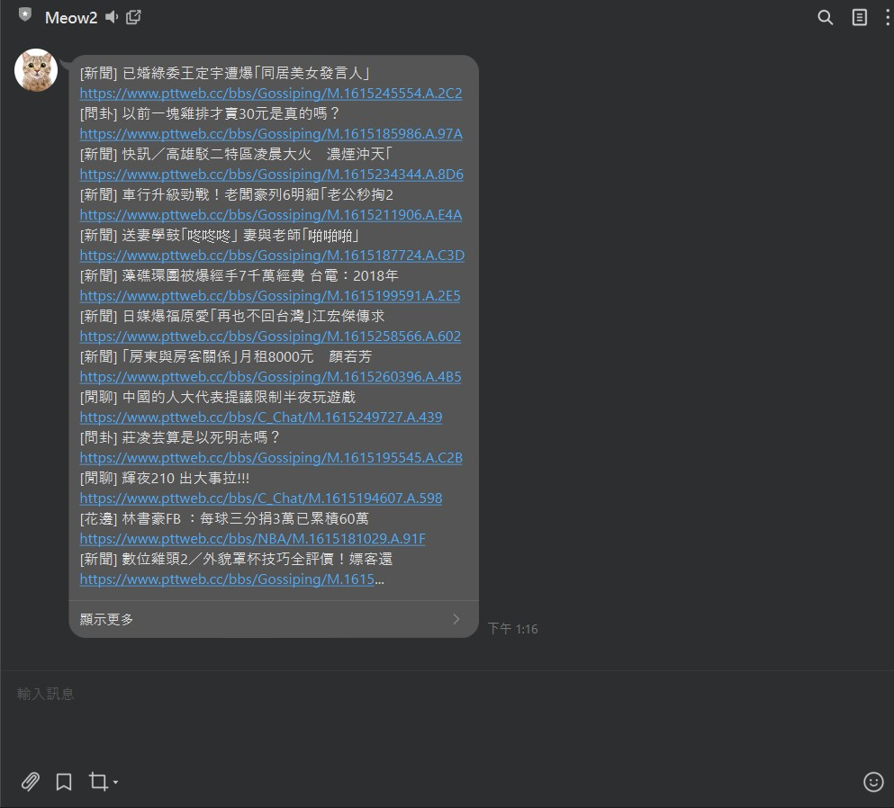
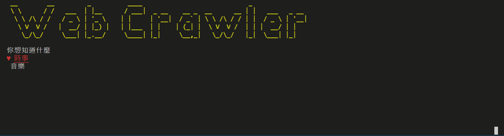

# Deploy with Docker
### [Remember to add --privileged flag to docker command!!](https://blog.csdn.net/chengly0129/article/details/72178806)

```
docker build -t meow-bot .
docker run -d -p 3000:3000 --privileged meow-bot
```

---

# Demo
## Linebot



## CLI
```sh
# Remember!
yarn install
yarn link
```

